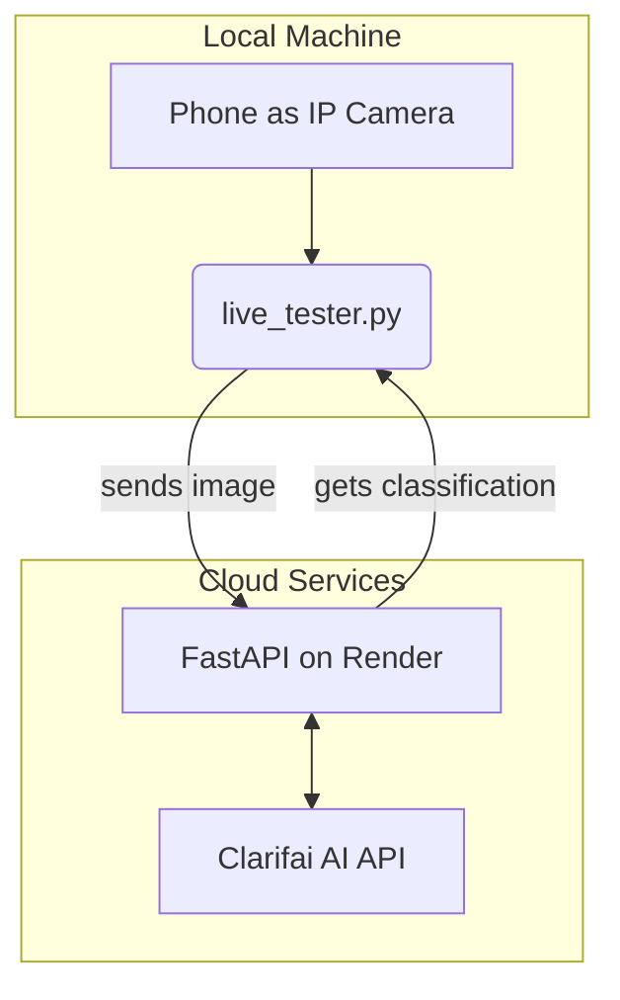

# AURo - The Autonomous Urban Recycler

[](https://auro-l4mh.onrender.com)

This repository contains the complete AI-powered backend and testing software for the Autonomous Urban Recycler (AURo) project. AURo is a robot designed to automatically identify and sort different types of waste.

---

## 📖 Table of Contents

- [How It Works](#how-it-works)
- [Current Features](#current-features)
- [Technology Used](#technology-used)
- [Setup and Installation](#-setup-and-installation)
- [How to Use](#-how-to-use)
- [Project Roadmap](#-project-roadmap)

---

## ⚙️ How It Works

The system uses a camera to capture an image of waste, sends it to an AI model in the cloud for analysis, and gets back the location and category of the waste.

Here is the flow of data:



1.  **Capture:** The `live_tester.py` script connects to a live video feed (like a phone running an IP camera app) to capture images.
2.  **Send:** When you press the spacebar, the script sends the current frame to our public API, which is hosted on Render.
3.  **Analyze:** The API takes the image and sends it to the **Clarifai AI** model, which is a powerful, pre-trained model specifically for object detection.
4.  **Receive:** The API gets the results back from Clarifai, including bounding boxes (the `[x, y, w, h]` coordinates of the object) and a category (like "paper" or "plastic").
5.  **Display:** The `live_tester.py` script receives this information and draws the bounding box and label directly onto the image, so you can see what the AI found in real-time.

---

## ✨ Current Features

- **Waste Detection API:** A robust backend built with **FastAPI** that can receive an image and return a list of detected waste items.
- **AI-Powered Classification:** Uses the **Clarifai General Detection model** to find and categorize objects. It can identify items and map them to our specific categories: `paper`, `plastic`, `glass`, `metal`, `e-waste`, `organic`, and `other`.
- **Publicly Deployed:** The API is live and accessible on the internet, deployed on **Render**. You can access it at [https://auro-l4mh.onrender.com](https://auro-l4mh.onrender.com).
- **Live Testing Script:** The `live_tester.py` script allows for real-time testing using a phone as an IP camera.
- **Visual Verification:** The tester script draws the bounding boxes returned by the API directly onto the captured frame, providing instant visual feedback on the AI's accuracy.

---

## 💻 Technology Used

- **Backend:** Python, FastAPI, Gunicorn, Uvicorn
- **AI / Computer Vision:** Clarifai API, OpenCV
- **Deployment:** Render, GitHub (for CI/CD)
- **Utilities:** `python-dotenv` for managing environment variables.

---

## 🚀 Setup and Installation

Follow these steps to get the project running on your own computer.

### 1. Clone the Repository

First, get the code onto your machine.
```bash
git clone https://github.com/GarvitSinghal1/auro.git
cd auro
```

### 2. Install Dependencies

It's highly recommended to use a Python virtual environment to keep dependencies clean.
```bash
# Create a virtual environment (optional but recommended)
python -m venv venv

# Activate it
# On Windows:
venv\Scripts\activate
# On macOS/Linux:
# source venv/bin/activate

# Install all the required packages
pip install -r requirements.txt
```

### 3. Set Up Your API Credentials

The project needs API keys to talk to the Clarifai service.

1.  Create a file named `.env` in the main project directory.
2.  Copy the contents of `.env.example` into your new `.env` file.
3.  **Get your Clarifai Credentials:**
    - Go to [Clarifai](https://clarifai.com/signup) and create a free account.
    - Create a new application.
    - Find your **User ID** and **App ID** from your application's URL or page. The URL looks like `https://clarifai.com/YOUR_USER_ID/apps/YOUR_APP_ID`.
    - Create a **Personal Access Token (PAT)** in your account settings. This is your API key.
4.  Fill in the values in your `.env` file:
    ```env
    # .env file
    CLARIFAI_API_KEY="your_personal_access_token_here"
    CLARIFAI_USER_ID="your_user_id_here"
    CLARIFAI_APP_ID="your_app_id_here"
    ```

---

## ▶️ How to Use

### Running the Local API Server

To test the API on your own machine, run this command from the project's main directory:
```bash
python -m api.main
```
This will start a server at `http://127.0.0.1:8000`.

### Using the Live Tester

The `live_tester.py` script is the best way to interact with the project.

1.  **Get an IP Camera App:** Install an IP Camera app on your phone (like "IP Webcam" on Android). Start the server.
2.  **Find your Phone's IP Address:** The app will show you a URL, usually something like `http://192.168.1.5:8080`.
3.  **Run the script:**
    ```bash
    # To connect to the public API on Render
    python live_tester.py --ip YOUR_PHONE_IP:PORT

    # Example:
    python live_tester.py --ip 192.168.29.56:8080

    # To connect to your LOCAL server (make sure it's running in another terminal)
    python live_tester.py --ip YOUR_PHONE_IP:PORT --local
    ```
4.  **Controls:**
    - A window will appear showing your camera feed.
    - Press the **SPACEBAR** to capture a frame and send it for classification.
    - A second "Verification" window will pop up showing the results.
    - Press **'q'** to quit.

---

## 🗺️ Project Roadmap

This is a list of planned features and improvements for the AURo project.

- [ ] **Hardware Integration:** Connect the software to the physical robot's ESP32-CAM and servo motors.
- [ ] **Servo Control Logic:** Implement the code that tells the servos where to move based on the classification result.
- [ ] **Improve Classification Mapping:** Expand the `CONCEPT_TO_CATEGORY_MAP` in `api/classifier.py` to recognize a wider variety of waste items with higher accuracy.
- [ ] **Train a Custom Model:** For ultimate performance, collect our own images and train a custom Clarifai model specifically on the types of waste AURo will encounter.
- [ ] **Web-Based Interface:** Create a simple web page for uploading images and seeing results, as an alternative to the Python script.
- [ ] **Error Handling:** Improve robustness for edge cases, such as when the lighting is poor or no objects are found. 