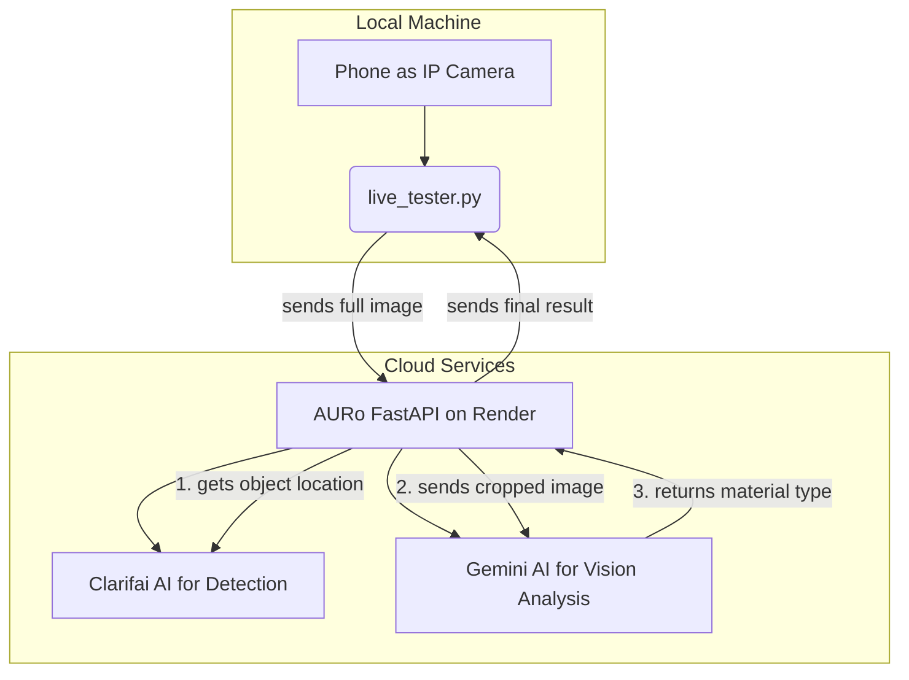

# AURo - The Autonomous Urban Recycler

[](https://auro-l4mh.onrender.com)

This repository contains the complete AI-powered backend and testing software for the Autonomous Urban Recycler (AURo) project. AURo is a robot designed to automatically identify and sort different types of waste.

---

## 📖 Table of Contents

- [How It Works](#how-it-works)
- [Current Features](#current-features)
- [Technology Used](#technology-used)
- [Setup and Installation](#-setup-and-installation)
- [How to Use](#-how-to-use)
- [Project Roadmap](#-project-roadmap)

---

## ⚙️ How It Works

The system uses a camera to capture an image of waste, sends it to an AI model in the cloud for analysis, and gets back the location and category of the waste.

Here is the flow of data:



1.  **Capture:** The `live_tester.py` script captures an image.
2.  **Send to API:** The script sends the full image to our public API on Render.
3.  **Step 1: Detect with Clarifai:** The API first sends the image to Clarifai's General Detection model. Clarifai's job is to find the *location* of all potential objects in the scene and return their bounding boxes.
4.  **Step 2: Crop and Analyze with Gemini:** For each high-confidence object found by Clarifai, our API crops the original image to that object's bounding box. It then sends this small, focused image to the **Gemini Vision** model and asks, "What material is this object made of?"
5.  **Combine and Respond:** The API collects the material classifications from Gemini and combines them with the corresponding bounding boxes from Clarifai.
6.  **Display:** The `live_tester.py` script receives this final, highly accurate data and draws the correct category and bounding box on the screen for verification.

---

## ✨ Current Features

- **Advanced Hybrid AI:** Uses a powerful two-stage process. **Clarifai** is used for fast, efficient object detection, and **Gemini Vision** is used for accurate, vision-based material analysis on cropped images.
- **Waste Detection API:** A robust backend built with **FastAPI** that can receive an image and return a list of detected waste items.
- **Publicly Deployed:** The API is live and accessible on the internet, deployed on **Render**. You can access it at [https://auro-l4mh.onrender.com](https://auro-l4mh.onrender.com).
- **Live Testing Script:** The `live_tester.py` script allows for real-time testing using a phone as an IP camera.
- **Detailed Debug Output:** The API response includes a `debug_info` object showing the full pipeline, including what Clarifai detected and how Gemini classified each object.

---

## 💻 Technology Used

- **Backend:** Python, FastAPI, Gunicorn
- **AI / Computer Vision:** Clarifai API (for detection), Gemini API (for vision analysis), OpenCV
- **Deployment:** Render, GitHub (for CI/CD)
- **Utilities:** `python-dotenv` for managing environment variables.

---

## 🚀 Setup and Installation

Follow these steps to get the project running on your own computer.

### 1. Clone the Repository

First, get the code onto your machine.
```bash
git clone https://github.com/GarvitSinghal1/auro.git
cd auro
```

### 2. Install Dependencies

It's highly recommended to use a Python virtual environment to keep dependencies clean.
```bash
# Create a virtual environment (optional but recommended)
python -m venv venv

# Activate it
# On Windows:
venv\Scripts\activate
# On macOS/Linux:
# source venv/bin/activate

# Install all the required packages
pip install -r requirements.txt
```

### 3. Set Up Your API Credentials

The project needs API keys to talk to the Clarifai and Gemini services.

1.  Create a file named `.env` in the main project directory. If you don't have one, you can copy `.env.example`.
2.  **Get your Clarifai Credential:**
    - Go to [Clarifai](https://clarifai.com/signup) and create a free account.
    - In your account settings, create a **Personal Access Token (PAT)**. This is your API key.
3.  **Get your Gemini Credentials:**
    - Go to [Google AI Studio](https://aistudio.google.com/app/apikey) and create an API key. You can create more than one key to increase your daily usage limits.
4.  Fill in the values in your `.env` file:
    ```env
    # .env file

    # Clarifai Key
    CLARIFAI_API_KEY="your_clarifai_personal_access_token"

    # Gemini Keys (add more as needed)
    GEMINI_API_KEY="your_first_gemini_api_key"
    GEMINI_API_KEY_2="your_second_gemini_api_key"
    # GEMINI_API_KEY_3="..."
    ```

---

## ▶️ How to Use

### Running the Local API Server

To test the API on your own machine, run this command from the project's main directory:
```bash
python -m api.main
```
This will start a server at `http://127.0.0.1:8000`.

### Using the Live Tester

The `live_tester.py` script is the best way to interact with the project.

1.  **Get an IP Camera App:** Install an IP Camera app on your phone (like "IP Webcam" on Android). Start the server.
2.  **Find your Phone's IP Address:** The app will show you a URL, usually something like `http://192.168.1.5:8080`.
3.  **Run the script:**
    ```bash
    # To connect to the public API on Render
    python live_tester.py --ip YOUR_PHONE_IP:PORT

    # Example:
    python live_tester.py --ip 192.168.29.56:8080

    # To connect to your LOCAL server (make sure it's running in another terminal)
    python live_tester.py --ip YOUR_PHONE_IP:PORT --local
    ```
4.  **Controls:**
    - A window will appear showing your camera feed.
    - Press the **SPACEBAR** to capture a frame and send it for classification.
    - A second "Verification" window will pop up showing the results.
    - Press **'q'** to quit.

---

## 🗺️ Project Roadmap

This is a list of planned features and improvements for the AURo project.

- [ ] **Hardware Integration:** Connect the software to the physical robot's ESP32-CAM and servo motors.
- [ ] **Servo Control Logic:** Implement the code that tells the servos where to move based on the classification result.
- [ ] **Fine-Tune Confidence:** Adjust the `CONFIDENCE_THRESHOLD` in `api/classifier.py` to find the perfect balance between sensitivity and accuracy for your specific environment.
- [ ] **Train a Custom Detection Model:** For even better performance, replace the general Clarifai model with a custom one trained only on images of waste. This would make the initial detection step faster and more accurate.
- [ ] **Web-Based Interface:** Create a simple web page for uploading images and seeing results, as an alternative to the Python script.
- [ ] **Error Handling:** Improve robustness for edge cases, such as when the lighting is poor or no objects are found. 